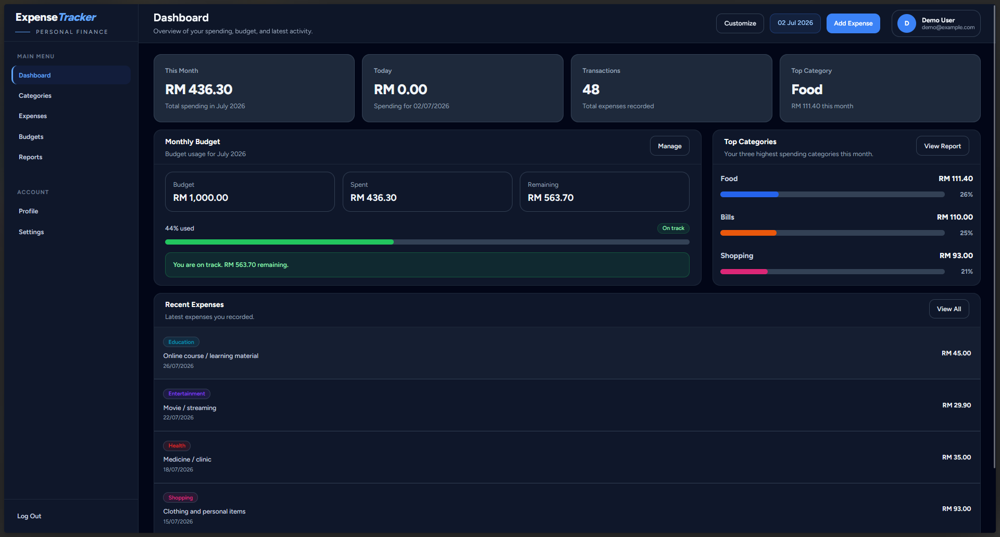

# Personal Expense Tracker


A modern personal expense tracking web application built with **Laravel 13**.
This project helps users record daily expenses, manage categories, track monthly budgets, review spending reports, import/export expense data, and customize account preferences through a clean responsive dashboard.

---

## Live Demo

**Live URL:** `https://expense-tracker-0thm.onrender.com`

The application is hosted on Render free tier, so the first visit may take a short moment to load if the service is sleeping.

### Demo Account

```txt
Email: demo@example.com
Password: password
```

---

## Table of Contents

- [Project Overview](#project-overview)
- [Features](#features)
- [Screenshots](#screenshots)
- [Tech Stack](#tech-stack)
- [Local Installation](#local-installation)
- [Environment Configuration](#environment-configuration)
- [Database Setup](#database-setup)
- [Demo Data](#demo-data)
- [Mailtrap Setup](#mailtrap-setup)
- [Deployment Notes](#deployment-notes)
- [Useful Commands](#useful-commands)
- [Project Structure](#project-structure)
- [Development Progress](#development-progress)
- [Git Commit Style](#git-commit-style)
- [Security Notes](#security-notes)
- [Portfolio Purpose](#portfolio-purpose)

---

## Project Overview

**Personal Expense Tracker** is a Laravel portfolio project focused on practical personal finance management.

The application allows users to:

- Record daily expenses
- Organize spending by category
- Monitor monthly budget usage
- Search, filter, sort, and paginate financial records
- Review dashboard summaries and report breakdowns
- Export reports to PDF and Excel
- Import expenses using CSV templates
- Manage personal account and app preferences

The project includes authentication, password reset, reusable Blade components, responsive layouts, dark mode support, AJAX pagination, settings management, Mailtrap SMTP integration for development email testing, and deployment using Render with Neon PostgreSQL.

---

## Features

### Authentication

- User registration
- User login and logout
- Remember Me login support
- Custom login error message
- Forgot Password
- Reset Password
- Mailtrap SMTP Sandbox for development email testing
- Email verification is postponed and can be enabled later during production mail setup

### Dashboard

- Monthly expense summary
- Today’s expense summary
- Total transaction count
- Top spending category
- Monthly budget progress
- Top categories breakdown
- Recent expenses overview
- User dashboard display preferences

### Categories

- Create categories
- Edit categories
- Delete categories
- Category color support
- Search categories
- Sort categories
- Paginated category list
- Responsive mobile card layout
- Desktop table layout

### Expenses

- Create expenses
- Edit expenses
- Delete expenses
- Assign expenses to categories
- Filter expenses by month, year, and category
- Search expense descriptions
- Sort by latest, oldest, highest amount, and lowest amount
- AJAX pagination
- Responsive mobile card layout
- Desktop table layout

### Budgets

- Create monthly budgets
- View budget history
- Track budget usage
- Budget status indicators
- Paginated budget list
- Responsive layout

### Reports

- Spending summary
- Category-based report breakdown
- Filtered expense report list
- Month and year report filtering
- Search and sort report records
- PDF export
- Excel export
- CSV import
- Downloadable CSV import template
- AJAX pagination

### Settings

- User preference settings
- Theme preference support
- Currency setting
- Dashboard display options
- Reset settings option

### UI / UX

- Responsive design
- Dark mode support
- Reusable Blade UI components
- Custom pagination design
- Toast notifications
- Empty states
- Mobile-friendly layouts
- Dashboard widgets
- Consistent validation styling

---

## Screenshots

Screenshots will be added after final UI testing.

Suggested folder:

```txt
docs/screenshots/
```

Suggested screenshots:

| Page         | Preview                           |
| ------------ | --------------------------------- |
| Welcome Page | `docs/screenshots/welcome.png`    |
| Login Page   | `docs/screenshots/login.png`      |
| Dashboard    | `docs/screenshots/dashboard.png`  |
| Expenses     | `docs/screenshots/expenses.png`   |
| Categories   | `docs/screenshots/categories.png` |
| Budgets      | `docs/screenshots/budgets.png`    |
| Reports      | `docs/screenshots/reports.png`    |
| Settings     | `docs/screenshots/settings.png`   |
| Dark Mode    | `docs/screenshots/dark-mode.png`  |
| Mobile View  | `docs/screenshots/mobile.png`     |

Example usage after adding screenshots:

```md

```

---

## Tech Stack

| Area                | Technology                |
| ------------------- | ------------------------- |
| Backend             | Laravel 13                |
| Language            | PHP                       |
| Frontend            | Blade, Tailwind CSS, Vite |
| Authentication      | Laravel Breeze            |
| Local Database      | MySQL                     |
| Production Database | PostgreSQL via Neon       |
| Deployment          | Render                    |
| Deployment Build    | Docker                    |
| Email Testing       | Mailtrap SMTP Sandbox     |
| Export              | PDF, Excel                |
| Version Control     | Git, GitHub               |

---

## Requirements

Make sure these are installed:

- PHP 8.3 or newer
- Composer
- Node.js
- npm
- MySQL
- Git

Optional tools:

- Docker
- Laravel Herd
- Redis

---

## Local Installation

Clone the repository:

```bash
git clone https://github.com/Hafidz-99/expense-tracker.git
cd expense-tracker
```

Install PHP dependencies:

```bash
composer install
```

Install frontend dependencies:

```bash
npm install
```

Copy the environment file:

For macOS / Linux:

```bash
cp .env.example .env
```

For Windows:

```bash
copy .env.example .env
```

Generate the application key:

```bash
php artisan key:generate
```

---

## Environment Configuration

Update your `.env` file based on your environment.

### Local Development Database

This project uses **MySQL locally**, usually through Docker or a local MySQL service.

```env
APP_NAME="Expense Tracker"
APP_ENV=local
APP_DEBUG=true
APP_URL=http://expense-tracker.test

DB_CONNECTION=mysql
DB_HOST=127.0.0.1
DB_PORT=3306
DB_DATABASE=expense_tracker
DB_USERNAME=root
DB_PASSWORD=secret

SESSION_DRIVER=file
CACHE_STORE=file
QUEUE_CONNECTION=sync
```

If you are using Laravel Herd, set `APP_URL` to your Herd site URL:

```env
APP_URL=http://expense-tracker.test
```

If you are using `php artisan serve`, use:

```env
APP_URL=http://127.0.0.1:8000
```

### Production Database

The deployed version uses **PostgreSQL through Neon**.

```env
APP_ENV=production
APP_DEBUG=false
APP_URL=https://your-render-app-name.onrender.com

DB_CONNECTION=pgsql
DB_HOST=your-neon-direct-host
DB_PORT=5432
DB_DATABASE=expense_tracker
DB_USERNAME=your_neon_username
DB_PASSWORD=your_neon_password
DB_SSLMODE=require

SESSION_DRIVER=file
CACHE_STORE=file
QUEUE_CONNECTION=sync
```

For production deployment, use the **direct Neon database host** instead of the `-pooler` host when running Laravel migrations.

---

## Database Setup

Create a local MySQL database:

```sql
CREATE DATABASE expense_tracker;
```

Run migrations:

```bash
php artisan migrate
```

---

## Docker Database Setup

If using Docker for local MySQL, use values like:

```env
DB_CONNECTION=mysql
DB_HOST=127.0.0.1
DB_PORT=3306
DB_DATABASE=expense_tracker
DB_USERNAME=root
DB_PASSWORD=secret
```

Then start your Docker containers and run:

```bash
php artisan migrate
```

---

## Demo Data

This project includes a demo data seeder for portfolio testing.

Run the demo seeder:

```bash
php artisan db:seed --class=DemoDataSeeder
```

Demo login:

```txt
Email: demo@example.com
Password: password
```

The demo data includes sample categories and expenses across multiple months so the dashboard, expense list, and reports have meaningful content.

---

## Running the Project

Start the frontend development server:

```bash
npm run dev
```

Start the Laravel development server:

```bash
php artisan serve
```

Or open your Laravel Herd site directly:

```txt
http://expense-tracker.test
```

---

## Building Assets

For production asset build:

```bash
npm run build
```

---

## Mailtrap Setup

This project uses **Mailtrap SMTP Sandbox** for development email testing.

Mailtrap is used for:

- Forgot Password emails
- Reset Password links
- Development mail testing

Mailtrap Sandbox does not send emails to real inboxes. Instead, it captures emails inside the Mailtrap inbox.

Example `.env` configuration:

```env
MAIL_MAILER=smtp
MAIL_SCHEME=null
MAIL_HOST=sandbox.smtp.mailtrap.io
MAIL_PORT=2525
MAIL_USERNAME=your_mailtrap_username
MAIL_PASSWORD=your_mailtrap_password
MAIL_FROM_ADDRESS="no-reply@expensetracker.test"
MAIL_FROM_NAME="${APP_NAME}"
```

After changing mail settings, clear Laravel config:

```bash
php artisan optimize:clear
```

To test the password reset flow:

1. Go to `/forgot-password`
2. Enter a registered email
3. Open Mailtrap inbox
4. Click the reset password link
5. Set a new password
6. Login with the new password

---

## Email Verification Note

Email verification is currently postponed.

Reason:

- The project currently uses Mailtrap Sandbox for development testing
- Live email sending usually requires a verified sending domain
- Email verification can be enabled later during deployment or production mail setup

Current behavior:

- Users can register and access the app after logging in
- Forgot Password and Reset Password still work through Mailtrap Sandbox

---

## Deployment Notes

The application is deployed on **Render** using Docker.

Production setup:

- Render for Laravel hosting
- Neon PostgreSQL for the production database
- GitHub-based deployment
- Docker build for PHP, Composer, Node, Vite assets, and Nginx
- Laravel migrations are executed during service startup

Because production uses PostgreSQL while local development uses MySQL, database queries are written to avoid MySQL-only functions where possible.

The app is hosted on Render free tier, so the first visit may take a short moment to load if the service is sleeping.

### Deployment Database Notes

For Neon production deployment:

```env
DB_CONNECTION=pgsql
DB_SSLMODE=require
```

Use the direct Neon host for Laravel migrations:

```txt
your-neon-host.region.aws.neon.tech
```

Avoid using the pooler host for migrations:

```txt
your-neon-host-pooler.region.aws.neon.tech
```

---

## Useful Commands

Clear cached files:

```bash
php artisan optimize:clear
```

Clear compiled views:

```bash
php artisan view:clear
```

Run migrations:

```bash
php artisan migrate
```

Rollback migrations:

```bash
php artisan migrate:rollback
```

Run seeders:

```bash
php artisan db:seed
```

Run demo seeder:

```bash
php artisan db:seed --class=DemoDataSeeder
```

Run frontend development server:

```bash
npm run dev
```

Build frontend assets:

```bash
npm run build
```

Check routes:

```bash
php artisan route:list
```

---

## Project Structure

```txt
app/
├── Exports/
├── Http/
│   ├── Controllers/
│   └── Requests/
├── Models/

database/
├── migrations/
└── seeders/

resources/
├── views/
│   ├── auth/
│   ├── budgets/
│   ├── categories/
│   ├── components/
│   │   └── ui/
│   ├── dashboard/
│   ├── expenses/
│   ├── layouts/
│   ├── profile/
│   ├── reports/
│   ├── settings/
│   └── welcome.blade.php

routes/
├── auth.php
└── web.php

docker/
├── nginx.conf.template
└── start.sh
```

---

## Main Modules

### Dashboard Module

Displays the main user overview, including monthly spending, today’s spending, total transactions, top category, budget progress, category breakdown, and recent expenses.

### Category Module

Allows users to manage custom expense categories with colors, search, sorting, pagination, and responsive layouts.

### Expense Module

Allows users to record, update, delete, filter, sort, and paginate expenses. Expenses can be linked to categories.

### Budget Module

Allows users to set monthly budgets and monitor their budget usage.

### Report Module

Provides spending summaries, category breakdowns, filtered expense lists, CSV import, downloadable import template, PDF export, and Excel export.

### Settings Module

Allows users to manage app preferences such as theme, currency, dashboard display options, and reset settings.

### Authentication Module

Handles user registration, login, logout, remember me, forgot password, reset password, and Mailtrap-based email testing.

---

## Development Progress

Current status: **Phase 9 — Testing, Optimization, Deployment, and Final Portfolio Polish**

Completed phases:

- Phase 1 — Project Setup
- Phase 2 — Categories and Expenses
- Phase 3 — Dashboard
- Phase 4 — Budget Management
- Phase 5 — Reports and Export
- Phase 6 — Search, Filtering, Sorting, and Pagination
- Phase 7 — UI / UX Polish
- Phase 8 — Settings
- Phase 9 — Auth flow polish, dark mode support, pagination polish, deployment, demo data, and final QA

Remaining final polish:

- Final validation message check
- Final empty state check
- Final dark mode scan
- Final mobile responsive scan
- Screenshots
- Portfolio write-up

---

## Git Commit Style

This project follows a clean commit message style:

```txt
chore: setup/configuration changes
feat: new functionality
refactor: code restructuring
style: UI/UX or visual polish
fix: bug fixes
docs: documentation updates
```

Example:

```bash
git commit -m "docs: update project readme"
```

---

## Security Notes

Do not commit sensitive environment files.

Make sure `.env` is ignored by Git:

```txt
.env
```

Do not commit:

- Database passwords
- Mailtrap credentials
- API keys
- Production secrets
- Neon database credentials
- Render environment variables

---

## Portfolio Purpose

This project was built as a Laravel portfolio project to demonstrate:

- Laravel CRUD development
- Authentication flow
- Password reset flow
- Mail testing with SMTP
- Dashboard analytics
- Filtering and pagination
- Budget tracking
- Report generation
- PDF and Excel export
- CSV import
- Responsive UI
- Dark mode implementation
- Reusable Blade components
- Local MySQL development
- PostgreSQL production deployment
- Docker-based deployment setup
- Git and GitHub workflow

---

## License

This project is currently intended for portfolio and learning purposes.
